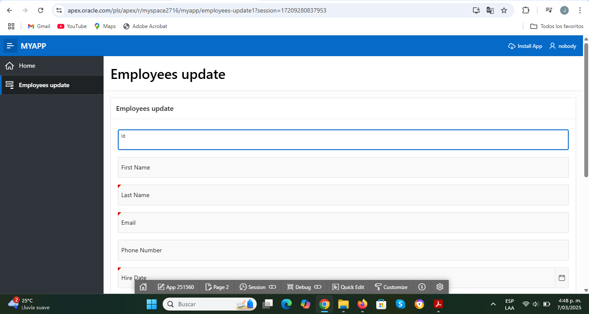
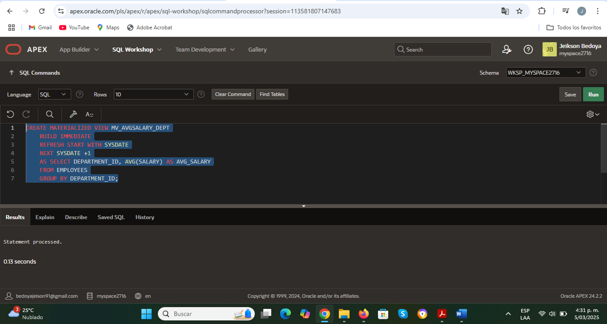
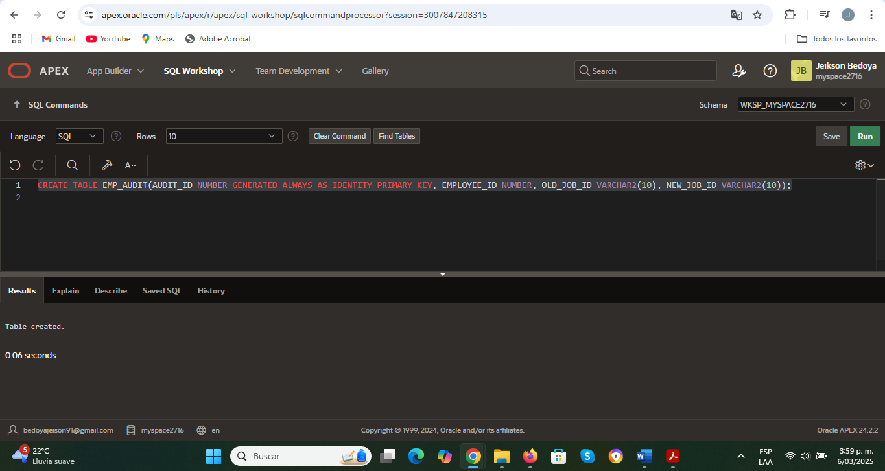

# 🗄️ Oracle APEX y PL/SQL

## Descripción

Proyecto académico enfocado en la administración y desarrollo de soluciones utilizando Oracle Database y Oracle APEX.

Durante el proyecto se trabajó con el esquema de recursos humanos (HR) de Oracle para implementar consultas SQL, procedimientos almacenados, funciones, triggers, materialized views y mecanismos de administración de usuarios y privilegios.

Adicionalmente, se desarrolló un formulario en Oracle APEX para la gestión de registros de empleados mediante operaciones de inserción y actualización.

---

## Objetivos

- Comprender el uso de Oracle APEX para el desarrollo de aplicaciones basadas en bases de datos.
- Ejecutar consultas SQL y desarrollar componentes en PL/SQL.
- Implementar mecanismos de automatización mediante procedimientos, funciones y triggers.
- Administrar usuarios, roles y privilegios en Oracle Database.
- Explorar estrategias de optimización mediante índices y materialized views.

---

## Tecnologías utilizadas

- Oracle Database
- Oracle APEX
- SQL
- PL/SQL

---

# Consultas SQL

Se desarrollaron consultas utilizando diferentes técnicas de análisis y recuperación de información:

- JOIN entre múltiples tablas.
- Subconsultas.
- Funciones de agregación.
- GROUP BY.
- Ordenamiento y filtrado de resultados.

Estas consultas permitieron obtener información relacionada con empleados, departamentos, salarios y ubicaciones.

---

# Desarrollo en PL/SQL

## Procedimientos almacenados

Se implementaron procedimientos para:

- Actualización masiva de salarios por departamento.
- Cálculo de estadísticas de empleados por departamento.
- Inserción de registros en tablas de Oracle.

## Funciones

Se desarrollaron funciones para:

- Cálculo de bonificaciones de empleados según antigüedad.

## Cursores

Se utilizaron cursores para recorrer conjuntos de registros y realizar actualizaciones condicionadas.

## Triggers

Se implementaron triggers para registrar cambios salariales y mantener trazabilidad sobre modificaciones realizadas en la información.

---

# Optimización y rendimiento

Durante el proyecto se trabajó con diferentes mecanismos de optimización:

## Materialized Views

Se creó una vista materializada para almacenar promedios salariales por departamento y facilitar consultas de análisis.

## Índices

Se implementaron índices para mejorar el rendimiento de consultas sobre tablas de empleados.

## Sequences

Se utilizaron secuencias para la generación automática de identificadores.

---

# Administración de Base de Datos

Se realizaron actividades relacionadas con la administración de Oracle Database:

- Creación y gestión de usuarios.
- Asignación de roles.
- Configuración de privilegios.
- Creación de tablespaces.
- Administración de cuotas de almacenamiento.
- Bloqueo y desbloqueo de cuentas.
- Gestión de permisos mediante comandos GRANT y REVOKE.

---

# 🖥️ Oracle APEX

## Formulario de gestión de empleados

Se desarrolló un formulario utilizando Oracle APEX para realizar operaciones de inserción y actualización sobre la tabla EMPLOYEES.

---

# 📷 Capturas del proyecto

## Materialized View

## Ejecución de procedimientos y consultas

---

# 📂 Contenido del repositorio

- `/sql` → Scripts SQL y PL/SQL desarrollados durante el proyecto.
- `/images` → Capturas representativas de la implementación.
- Scripts de consultas SQL.
- Procedimientos almacenados.
- Funciones.
- Triggers.
- Materialized Views.
- Administración de usuarios y privilegios.

---

# ✅ Resultados obtenidos

- Fortalecimiento de conocimientos en SQL y PL/SQL.
- Implementación de mecanismos de automatización en bases de datos Oracle.
- Aplicación de conceptos de administración y seguridad de bases de datos.
- Desarrollo de componentes en Oracle APEX para interacción con la información.
- Comprensión de estrategias de optimización y gestión de objetos en Oracle Database.

---

## 👨‍💻 Autor

**Jeikson Bedoya Gómez**

Proyecto desarrollado como parte de la formación en Ingeniería de Sistemas.
